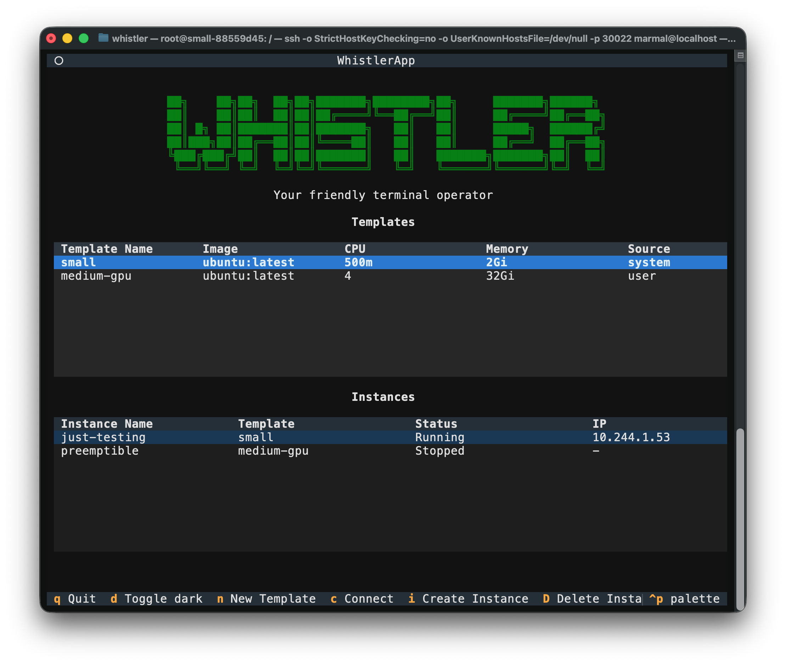

# Whistler

> "I want peace on earth and goodwill toward men." - Irwin Emery

Whistler is a Kubernetes Operator that provisions on-demand and persistant instances in a cluster through SSH.

**Note**: Whistler is currently in active development, **you should not install it!*** <br>
**Note**: Whistler is also a test of using Google Antigravity, that experience it currently being detailed [here](antigravity_and_claude.md)

Whistler has the following features:

- Ease of use: users use standard SSH — `ssh <instance>.w` through the gateway as a jump host — to connect to a session or create one on-demand; scp/rsync/sftp/port-forwarding/VS Code Remote work natively
- A launcher TUI (`ssh user@gateway`) that lists sessions, starts them and connects; templates, users, groups and zones are managed in a web portal
- Sessions can be preemptible, ephemeral, or persistent
- Support for ssh agent and port forwarding
- Whistler is *not* a general purpose way to connect to running pods



# Design

Whistler is implemented as a Kubernetes Operator that uses the Gateway API and AsyncSSH to expose SSH sessions and an administrative interface to users. Interactive sessions are either connected to using the interface, or through simply ssh:ing to the service which will then create a pod on-the-fly. 

Whistler will on install also create number of CRDs to keep track of instances and templates. There is, by design, no database used to store data, rather state is stored in the cluster as CRs.

It uses the following CRDs:

- `WhistlerTemplate`: A template for creating instances
- `WhistlerInstance`: An instance of a template

One PV, through a PVC, is created for each user to store their home directory, unless specified otherwise in the template or instance. Other volumes can be mounted as needed.

# Install

Whistler needs a cluster, and — for anything beyond throwaway container
sessions — KubeVirt. The rest of this section is in install order: the two
things that go in *before* Whistler (KubeVirt, and optionally an S3 endpoint
for shared datasets), then the chart itself, then the two optional pieces that
only matter if you are building your own VM images.

## Prerequisites

- Kubernetes 1.28+ and `kubectl`, with a default StorageClass.
- Helm 3.8+ (OCI registry support).
- For VM sessions: nodes with `/dev/kvm`. Without it KubeVirt can be told to
  emulate, which works and is slow.
- For GPU passthrough: the host driver, IOMMU and the NVIDIA GPU Operator in
  `sandboxWorkloads` mode, plus the card on the KubeVirt CR's allow-list (see
  "GPU passthrough" under KubeVirt below). The node side is out of scope here;
  see [scripts/metal_k3s_create.sh](scripts/metal_k3s_create.sh), which sets
  up a single-node k3s host end to end.

A note on storage: a home volume is a `disk.img` on a PVC attached to the VM as
a virtio-blk disk, so an NFS-backed StorageClass is fine for homes. It is *not*
fine for the (now optional) NFS storage gateway — see
[design/storage.md](design/storage.md).

## 1. KubeVirt

Required for `runtime: vm` templates, which is every desktop and every SSH-
reachable session today. Container sessions work without it, but are reachable
only through the portal's web terminal.

The scripted path installs KubeVirt, CDI and `virtctl` against whatever cluster
your current `KUBECONFIG` points at:

```bash
scripts/install_kubevirt.sh
```

It is safe to re-run. Against a cluster that already has KubeVirt it
reconciles configuration and `virtctl` and then stops — it will **not** change
the version unless you ask, because the default version is "whatever
`stable.txt` says today" and a re-run months later would otherwise move the
cluster silently:

```bash
$ scripts/install_kubevirt.sh
==> KubeVirt v1.8.4 is already installed (target: v1.9.0)
ERROR: KubeVirt is installed at v1.8.4; this run targets v1.9.0.
       Not upgrading by default. Re-run with KUBEVIRT_UPGRADE=1 to upgrade, or
       pin this run to the installed version with KUBEVIRT_VERSION=v1.8.4.

$ KUBEVIRT_UPGRADE=1 scripts/install_kubevirt.sh      # actually upgrade
```

KubeVirt supports one minor release at a time (N-1 → N) and no downgrades, and
CDI is the same; a jump that breaks that rule is refused even with
`KUBEVIRT_UPGRADE=1`. Upgrades wait on `status.observedKubeVirtVersion`
reaching the requested version with `phase: Deployed` — not on
`condition=Available`, which is already true on an existing install and stays
true while virt-operator rolls the components — and report any running VM
workloads still on the old virt-launcher, which pick up the new version on
their next restart.

Knobs (all env vars): `KUBEVIRT_VERSION` (default: latest stable),
`KUBEVIRT_UPGRADE=1` to allow changing the version of an existing install,
`KUBEVIRT_FORCE=1` to allow an unsupported version jump,
`KUBEVIRT_USE_EMULATION=1` for nodes with no `/dev/kvm` (`=0` turns it back
off; leave it unset to keep whatever is configured),
`KUBEVIRT_INSTALL_CDI=0` to skip CDI, `CDI_VERSION`. Plus one argument,
`--allow-gpu`, for GPU passthrough (next).

**GPU passthrough.** KubeVirt hands a host PCI device to a guest only if the
`KubeVirt` CR's `permittedHostDevices` names it, and nothing fills that list in
for you: the GPU Operator's `sandbox-device-plugin` binds the card to vfio-pci
and advertises it on the node, but both NVIDIA and KubeVirt leave the
allow-list itself to the admin, on purpose — it is the cluster's decision about
what may enter a root-capable guest, and there is no wildcard or discovery mode
for it. Rather than typing the patch, say which cards and let the script write
it on every run:

```bash
scripts/install_kubevirt.sh --allow-gpu AD102_GEFORCE_RTX_4090 --allow-gpu GH100_H100_SXM5_80GB
scripts/install_kubevirt.sh --allow-gpu auto        # every NVIDIA display device on the nodes
scripts/install_kubevirt.sh --allow-gpu 10de:2684   # by PCI id (lspci -nn -d 10de: prints it)
scripts/install_kubevirt.sh --allow-gpu none        # clear the list
```

An entry needs two halves — the PCI id for KubeVirt's `pciVendorSelector` and
the resource name the plugin will advertise — and the script resolves whichever
you did not give from `pci.ids`, deriving the name by the plugin's own rule
(upper-case, whitespace to `_`, everything else outside `[A-Za-z0-9_]`
dropped: `AD102 [GeForce RTX 4090]` → `AD102_GEFORCE_RTX_4090`). `auto` does
not look at the machine running the script, which is rarely a node: it starts a
throwaway `busybox` pod on each node carrying the GPU Operator's NFD label
`feature.node.kubernetes.io/pci-10de.present=true` (every node, when none has
it) and reads the PCI bus from the pod's own `/sys/bus/pci/devices`, which any
unprivileged pod can do. It keeps PCI class `03xx` only, so the card's audio
controller — advertised right next to the GPU, and not to be permitted, since
Whistler's GPU catalog reads this list to tell the two apart — is skipped;
giving its id by hand earns a warning. `PCI_PROBE_IMAGE` and
`PCI_PROBE_NODE_SELECTOR` override the probe's image and node set. The name
half comes from `pci.ids`: the copy pciutils or hwdata installed if there is
one (Homebrew included, or `PCI_IDS=/path`), otherwise the script fetches the
file the plugin itself is built from (`PCI_IDS_URL`, pci-ids.ucw.cz) into
`~/.cache/whistler/` and keeps it for 30 days, so nothing needs installing on
the workstation. Entries are written with
`externalResourceProvider: true` (the plugin allocates, KubeVirt only permits)
and the arguments are the single author of `pciHostDevices`: `none` clears it,
no argument leaves it alone. Two caveats. The plugin reads the `pci.ids` its
image was built with and the script reads the host's, so a very new card can be
named differently; the script prints a note for a permitted resource no node
advertises, which is normal until the node is labelled
`nvidia.com/gpu.workload.config=vm-passthrough` and a bug if it stays. And a
name shared by several device ids (old GeForce and chipset parts, no data-centre
card) is refused as ambiguous — pick by id, or give both as
`10de:2684=nvidia.com/AD102_GEFORCE_RTX_4090`.

[scripts/metal_k3s_create.sh](scripts/metal_k3s_create.sh) forwards
`--allow-gpu` and defaults to `auto` whenever it installs the GPU Operator on a
host with an NVIDIA display device, turning on the operator's
`sandboxWorkloads` at the same time. Permitting is not binding: the card stays
with the host driver until you label the node, which the script prints how to
do and deliberately never does itself.

**Already running KubeVirt?** Skip the script — it is a convenience, not a
requirement. What Whistler actually needs from the cluster:

- The `kubevirt.io/v1` API. Whistler creates `VirtualMachine`s imperatively
  and uses the `/vnc` and `/console` subresources for the portal's screen and
  serial views. Developed and tested against v1.8–v1.9; older releases likely
  work but are untested.
- CDI, and only for templates that boot from an `imageURL` (see below) — a
  cluster where every template uses a containerDisk does not need it.
- No non-default feature gates. (The script still sets
  `EnableVirtioFsStorageVolumes`, a leftover from the retired virtiofs home
  path; nothing requires it and it is pending removal.)

On a cluster where another operator owns KubeVirt — HCO / OpenShift
Virtualization — do **not** run the script at all, not even for its
reconcile-only re-run: it patches the `KubeVirt` CR directly (feature gates,
emulation), and HCO reconciles that CR from its own `HyperConverged` CR and
reverts direct edits. Nothing needs patching on such a cluster anyway; grab
`virtctl` from the [KubeVirt releases](https://github.com/kubevirt/kubevirt/releases)
yourself if you want it.

Note that there is **no official KubeVirt Helm chart** — the request
([kubevirt#8347](https://github.com/kubevirt/kubevirt/issues/8347)) is still
open. It is not much of a loss: virt-operator creates the workload CRDs
(`VirtualMachine`, `VirtualMachineInstance`, …) at runtime, so a chart would
own only the operator Deployment and the `KubeVirt` CR while everything that
matters is made by a controller Helm cannot see — leaving it nothing correct
to wait on during an upgrade, and orphaned CRDs after `helm uninstall`.

By hand, if you would rather see every step:

```bash
VERSION=$(curl -sfL https://storage.googleapis.com/kubevirt-prow/release/kubevirt/kubevirt/stable.txt)
BASE=https://github.com/kubevirt/kubevirt/releases/download/${VERSION}

kubectl apply -f ${BASE}/kubevirt-operator.yaml
kubectl apply -f ${BASE}/kubevirt-cr.yaml          # retry until the CRD registers
kubectl -n kubevirt wait kubevirt kubevirt --for=condition=Available --timeout=15m
```

CDI is only needed for templates that boot from an `imageURL` (an HTTP qcow2
imported into a persistent root disk) rather than a containerDisk:

```bash
CDI=$(curl -sfL https://api.github.com/repos/kubevirt/containerized-data-importer/releases/latest \
        | sed -n 's/.*"tag_name": *"\([^"]*\)".*/\1/p')
CDI_BASE=https://github.com/kubevirt/containerized-data-importer/releases/download/${CDI}

kubectl apply -f ${CDI_BASE}/cdi-operator.yaml
kubectl apply -f ${CDI_BASE}/cdi-cr.yaml
kubectl wait cdi cdi --for=condition=Available --timeout=10m
```

No libvirt is needed on the host or the nodes — KubeVirt bundles libvirt and
qemu inside its `virt-launcher` pods.

### Preparing the nodes

Two things KubeVirt does not check for you, both learned the hard way on a
production k0s node. Neither produces an error message that names it.

**Hugepages.** Whistler backs guest RAM with 2 MiB hugepages by default
(`whistler.hugePages.pageSize` in values.yaml — VFIO pins the whole guest at
device attach, and at 4 KiB pages a large GPU guest blows virt-handler's 20 s
sync deadline). Every node that runs VMs has to reserve them; they are never
allocated on demand. Persistently, on the kernel command line:

```
hugepagesz=2M hugepages=<count>        # count = GiB of guest RAM × 512
```

or on a running node:

```bash
echo <count> | sudo tee /proc/sys/vm/nr_hugepages
sudo systemctl restart k0sworker       # k3s: systemctl restart k3s
```

**The restart is not optional.** kubelet reads the hugepage pools once, at
startup. Until it restarts the node advertises `hugepages-2Mi: 0` and every VM
pends on `Insufficient hugepages-2Mi` while `/proc/meminfo` shows the pages
sitting free. Check what the scheduler sees, not what the kernel has:

```bash
kubectl get node <node> -o jsonpath='{.status.allocatable.hugepages-2Mi}{"\n"}'
```

The pool comes out of ordinary allocatable memory (a 512 GiB pool on a 1 TiB
node leaves ~512 GiB for pods), and kubelet re-admits every running pod against
the smaller number when it restarts, so size the pool and drain accordingly.
[scripts/metal_k3s_create.sh](scripts/metal_k3s_create.sh) prints what a node
has in both sizes. To run guests on ordinary pages instead:
`--set whistler.hugePages.pageSize=""`.

**k0s — or any distribution whose kubelet root is not `/var/lib/kubelet`.**
virt-handler hostPath-mounts `/var/lib/kubelet` and `/var/lib/kubelet/pods`
without checking they exist. k0s keeps kubelet under `/var/lib/k0s/kubelet`, so
kubelet creates an empty `/var/lib/kubelet`, virt-handler mounts it, reports
itself healthy, and can never finish a VM: every VMI — a stock cirros included —
goes `Scheduled → Failed` in about three seconds, virt-controller retries it
into `CrashLoopBackOff`, and **nothing logs an error**, because nothing failed;
a directory was empty. Whistler's portal now reports such a VM as `Error` with
KubeVirt's `CrashLoopBackOff` in the session's status message, which is your
cue to look here.

Upstream fix: [kubevirt#16346](https://github.com/kubevirt/kubevirt/pull/16346)
(merged 2026-09-03) adds a `--kubelet-root` flag for virt-handler, set through
`KubeVirt.spec.customizeComponents`. Until you run a release that carries it,
present the real root at the path virt-handler expects, on every node that runs
VMs:

```bash
sudo mkdir -p /var/lib/kubelet
echo '/var/lib/k0s/kubelet /var/lib/kubelet none bind 0 0' | sudo tee -a /etc/fstab
sudo mount /var/lib/kubelet
sudo reboot
```

The reboot matters: virt-handler's device plugins (`devices.kubevirt.io/kvm`,
`tun`, `vhost-net`) register with kubelet over sockets under that same root, and
the stale set did not recover on a virt-handler restart alone. Repointing the
two hostPaths with `customizeComponents` was tried first and left virt-handler
marking the node `kubevirt.io/schedulable=false` — don't. k3s uses
`/var/lib/kubelet` and needs none of this.

## 2. VersityGW (optional — an S3 endpoint for shared datasets)

Shared data in Whistler is **S3 datasets, not filesystems**
([design/storage.md](design/storage.md)). If the site already has an S3
endpoint, use that and skip to step 3. If it does not, VersityGW serves S3 from
an ordinary POSIX directory, which means it runs on the same StorageClass
everything else does.

Install it into **its own namespace**, not Whistler's. That separation is the
point of the design: sessions never reach the S3 server, they reach a proxy
Whistler runs, and the zone egress rule names an address Whistler owns.

```bash
kubectl create namespace s3

# The root credential, kept out of `helm get values` and the release history.
kubectl -n s3 create secret generic versitygw-root \
  --from-literal=rootAccessKeyId=CHANGEME \
  --from-literal=rootSecretAccessKey=CHANGEME-SECRET

helm install s3 oci://ghcr.io/versity/versitygw/charts/versitygw \
  --namespace s3 \
  --set auth.existingSecret=versitygw-root \
  --set gateway.backend.type=posix \
  --set gateway.backend.args=/mnt/data \
  --set persistence.enabled=true \
  --set persistence.size=100Gi
```

That yields a `s3-versitygw` Service on port 7070 in namespace `s3`, i.e.
`http://s3-versitygw.s3.svc.cluster.local:7070` from inside the cluster. A
bucket is a top-level directory under the backend path:

```bash
kubectl -n s3 exec deploy/s3-versitygw -- mkdir -p /mnt/data/reference-data
```

Then create the credential **Whistler** hands its dataset proxy — note the key
names differ from the chart's own secret:

```bash
kubectl -n whistler create secret generic s3-reference-data \
  --from-literal=accessKeyId=CHANGEME \
  --from-literal=secretAccessKey=CHANGEME-SECRET
```

and reference it from `whistler.datasets` in the values below. The credential
lives in the proxy and nowhere else — it never enters a guest whose user has
root.

**Keep the endpoint cluster-internal.** A bearer token has no zone, so an S3
endpoint reachable from outside the cluster is reachable from every zone at
once. Leave `ingress.enabled=false`.

For a throwaway rig with a pre-seeded bucket and plaintext credentials, there
is also [manifests/s3-rig/versitygw.yaml](manifests/s3-rig/versitygw.yaml).

## 3. An example `values.yaml`

```yaml
image:
  repository: ghcr.io/marma/whistler
  tag: "dev"

server:
  service:
    type: NodePort
    nodePort: 30022          # ssh here

portal:
  enabled: true
  # Both portal apps on one origin, through the chart's bundled Traefik pod.
  # This is the whole configuration: the Ingress brings that pod up itself and
  # points at it, and the portal Services stay ClusterIP. Leave `host` out if
  # you reach the cluster by IP and have no name yet.
  ingress:
    enabled: true
    host: whistler.example.com
  # A shared name/password on that proxy, covering both portal apps and every
  # way in that reaches it — the Ingress above, and a port-forward or NodePort
  # on `proxy.service` alike. A lock on the door, not a login: it does not
  # decide which Whistler user you are, and everyone shares the one password.
  # Worth having while `auth.allowAny` is on (below), since that combination
  # means any password signs anyone in.
  proxy:
    basicAuth:
      enabled: true
      username: whistler
      password: "change-me"  # or `users: ["alice:$2y$05$..."]` from htpasswd -nB
  auth:
    # No web SSO yet. allowAny accepts any password at /login and is the only
    # way in today; allowAdmin would additionally make everyone an admin, so
    # name your admins here instead.
    allowAny: true
    allowAdmin: false
    adminUsers: "alice"
  screenshots:
    intervalSeconds: 300     # 0 disables; the stored box is the whole policy
    maxWidth: 960            # 960x540 reads window titles and menus;
    maxHeight: 540           # 320 is the coarse activity overview

whistler:
  # Seeded once, at operator startup. Never overwritten afterwards — manage
  # the account in the portal from then on.
  bootstrapAdmin:
    name: alice
    publicKeys:
      - ssh-ed25519 AAAAC3NzaC1lZDI1NTE5AAAAI... alice@laptop

  ssh:
    domainSuffix: ".w"       # client-side convention; nothing resolves it

  # Named egress postures. A session picks one via its template and changes
  # zone only on reboot. "default" exists whether or not you define it.
  zones:
    default:
      egress:
        allowCIDRs: []       # deny-all except DNS
    green:
      egress:
        blockCIDRs:          # internet yes, internal no
          - 10.0.0.0/8
          - 172.16.0.0/12
          - 192.168.0.0/16
      dns:
        clusterOnly: true

  # Boot sources a `runtime: vm` template may use. ENFORCED — a template
  # naming anything not listed here fails closed at reconcile time.
  images:
    vm:
      - quay.io/containerdisks/ubuntu:24.04
      - localhost:5000/whistler-devbase:latest

  homeDisk:
    size: 20Gi

  # Shared S3 datasets, mounted at /shared/<name> on VM sessions. The
  # credential named here stays in the proxy Whistler starts.
  datasets:
    reference-data:
      description: Imaging corpus
      bucket: reference-data
      endpoint: http://s3-versitygw.s3.svc.cluster.local:7070
      provider: Other
      readOnly: true         # a ceiling, not a default — prefer it
      credentialsSecret: s3-reference-data

  # A project's shared grants. Membership lives here, not on the user.
  groups:
    lab-staff:
      description: Internal staff on the imaging project
      members: [alice, bob]
      allowedZones: [green]
      # The access matrix: zone -> volume -> allowed | read-only. A cell is
      # (zone, volume, mode), not a name — an absent cell is no access.
      volumeAccess:
        green:
          reference-data: read-only

templates:
  small:
    description: "Small SSH container (web terminal only)"
    mode: ssh
    runtime: container
    image: "ubuntu:latest"
    resources:
      cpu: 500m
      memory: 2Gi

  devbase:
    description: "Ubuntu 26.04 dev server (SSH)"
    mode: ssh
    runtime: vm
    image: "localhost:5000/whistler-devbase:latest"
    persistence: persistent
    resources:
      cpu: "4"
      memory: 8Gi

userVolume:
  accessMode: ReadWriteMany
  size: 10Gi
```

A fuller, commented reference is
[charts/whistler/values.yaml](charts/whistler/values.yaml); the VM template
catalog used in development is
[charts/whistler/values-dev-vm.yaml](charts/whistler/values-dev-vm.yaml).

## 4. Whistler

From the published chart (pushed on `v*` tags):

```bash
helm install whistler oci://ghcr.io/marma/charts/whistler \
  --namespace whistler --create-namespace \
  -f values.yaml
```

or from a checkout, which is what you want while Whistler is still in active
development:

```bash
helm install whistler charts/whistler \
  --namespace whistler --create-namespace \
  -f values.yaml
```

Helm installs the CRDs on first install only. **`helm upgrade` never updates
them**, and both failure modes are quiet — a new kind 404s, and a new field on
an existing kind is silently pruned by the API server so it round-trips as if
you never set it. After pulling a version that changes
[charts/whistler/crds/crds.yaml](charts/whistler/crds/crds.yaml), apply it by
hand:

```bash
kubectl apply -f charts/whistler/crds/crds.yaml
helm upgrade whistler charts/whistler -n whistler -f values.yaml
```

Check it came up, then connect as the bootstrap admin:

```bash
kubectl -n whistler get pods
kubectl -n whistler get zones,groups,templates

ssh alice@<node> -p 30022               # the launcher TUI
open http://whistler.example.com        # the portal, via the Ingress above
```

The Ingress hostname has to resolve to your ingress controller — a DNS record,
or a line in `/etc/hosts` pointing at the address of
`kubectl -n kube-system get svc traefik`. With no ingress controller (or no
name), skip the Ingress and port-forward the same origin instead:

```bash
helm upgrade whistler charts/whistler -n whistler -f values.yaml \
  --set portal.ingress.enabled=false --set portal.proxy.enabled=true
kubectl -n whistler port-forward svc/whistler-portal-proxy 8080:80
```

Either way the browser asks for the `proxy.basicAuth` name and password first
(`whistler` / `change-me` above), and then the portal's own `/login` asks for a
Whistler username — any password, since `auth.allowAny` is what accepts it.
Two prompts, answering two different questions: the first says you may reach
this origin at all, the second says who you are once you have.

## 5. Optional: an image registry in the cluster

Only needed if you build your own VM images (step 6) and have nowhere to push
them. The dev arrangement is `registry:2` with `hostNetwork`, so the *same*
address — `localhost:5000` — works for the host's Docker daemon pushing and
for the node's containerd pulling. No TLS, no auth: this is a dev registry on a
single-node cluster, not something to expose.

[scripts/metal_k3s_create.sh](scripts/metal_k3s_create.sh) sets this up as part
of creating the cluster (`METAL_REGISTRY=0` to skip, `REGISTRY_PORT` to move
it). On an existing k3s host the two pieces are:

```bash
# 1. containerd: a plain-HTTP endpoint for localhost:5000 image refs.
sudo tee /etc/rancher/k3s/registries.yaml >/dev/null <<'EOF'
mirrors:
  "localhost:5000":
    endpoint:
      - "http://localhost:5000"
EOF
sudo systemctl restart k3s

# 2. the registry itself — see scripts/metal_k3s_create.sh for the manifest
#    (hostNetwork, REGISTRY_HTTP_ADDR=127.0.0.1:5000, a local-path PVC).
```

Then point skaffold at it, if you use skaffold:

```bash
skaffold config set --kube-context <context> default-repo localhost:5000
```

Every image tag a template references must also appear in
`whistler.images.vm`, or the session fails closed.

## 6. Optional: building and pushing base/desktop images

The stock `quay.io/containerdisks/ubuntu:24.04` boots and is enough to try
Whistler out. The images in this repo are the real ones: a dev server reached
over SSH, and two baked desktops.

All three use the same pipeline — boot the Ubuntu cloud image once under
qemu/KVM inside a container, let cloud-init install everything, then wrap the
resulting qcow2 as a KubeVirt containerDisk. The host needs `docker`, `curl`
and access to `/dev/kvm`; the bake takes tens of minutes. **amd64 only** — the
guest runs under KVM, so producing arm64 needs an arm64 host.

```bash
# Dev server: Ubuntu 26.04, clang 21, Python 3.14, pixi. SSH, no desktop.
make devbase-image                          # -> localhost:5000/whistler-devbase:latest
make devbase-image VARIANT=cuda PUSH=1      # + the NVIDIA driver (GPU runtime, no nvcc)
make devbase-image VARIANT=cuda-dev PUSH=1  # + the CUDA SDK (nvcc, ~4.6GB)

# Desktops: XFCE or GNOME Shell with Selkies baked into the guest.
make vm-desktop-image PUSH=1                # -> localhost:5000/whistler-vm-xfce-selkies:latest
make vm-desktop-image CUDA=1 PUSH=1         # -> ...-vm-xfce-selkies-cuda:latest
make vm-gnome-desktop-image PUSH=1          # -> localhost:5000/whistler-vm-gnome-selkies:latest
make vm-gnome-desktop-image CUDA=1 PUSH=1   # -> ...-vm-gnome-selkies-cuda:latest
```

Knobs, on every build script: `IMAGE`, `TAG`, `PUSH=1`, `DISK_SIZE`,
`QEMU_MEM`, `QEMU_SMP`, `BASE_IMAGE_URL`, `CACHE_DIR`, `BAKE_TIMEOUT`.

Two things about naming, both deliberate:

- **The variant rides in the image *name*, never the tag.** Kubernetes (and
  KubeVirt, for containerDisks) defaults only the exact tag `:latest` to
  `imagePullPolicy: Always`. A mutable dev tag must literally be `:latest`, or
  nodes keep booting a stale cached qcow2 after every rebuild —
  `:latest-cuda` would not match. Production uses immutable versioned tags,
  which correctly default to `IfNotPresent`.
- Everything is **baked, not installed at session time**, because the default
  zone blocks package mirrors. A session gets what its image has.

Verify a devbase build before pointing templates at it — this boots the disk
with the real per-session cloud-init and asserts the toolchain over SSH:

```bash
images/devbase/test.sh
```

Then add the tags to `whistler.images.vm` and write templates against them; see
[images/devbase/README.md](images/devbase/README.md) and
[design/creating_desktops.md](design/creating_desktops.md).

# Uninstall

Order matters, for two reasons Helm cannot see: the operator holds a
finalizer on every Session CR (its delete handler is what tears down the
pod/VM behind it), and per-user namespaces are created imperatively by the
operator, not by the chart. Remove the release first and both are stranded —
Session CRs, and any namespace containing one, hang in `Terminating` on a
finalizer no controller is left to clear.

```bash
# 1. End every session while the operator is still there to clear its
#    finalizers and delete the pods/VMs behind them.
kubectl delete sessions --all --all-namespaces

# 2. The release: deployments, services, RBAC, and the Helm-owned
#    Zone/Group/Template CRs. `helm uninstall` does not undo
#    --create-namespace, hence the second line.
helm uninstall whistler -n whistler
kubectl delete namespace whistler

# 3. Per-user namespaces. Every user's home PVC, storage gateway, secrets
#    and NetworkPolicies live here — THIS DELETES USER DATA.
kubectl delete namespaces -l whistler.martinmalmsten.net/managed=true

# 4. The CRDs. Helm never touches these (install-only, see step 4 of the
#    install); deleting them cascades to any CR of those kinds still left,
#    portal-created Users among them.
kubectl delete -f charts/whistler/crds/crds.yaml
```

Nothing else cluster-scoped remains: the PriorityClass and RBAC are
Helm-owned and go with the release.

If the steps ran out of order and something hangs in `Terminating`, it is
almost always a Session finalizer with the operator already gone. Clear them
by hand and deletion resumes:

```bash
kubectl get sessions -A --no-headers \
  -o custom-columns=NS:.metadata.namespace,NAME:.metadata.name \
| while read ns name; do
    kubectl -n "$ns" patch session "$name" --type=merge \
      -p '{"metadata":{"finalizers":[]}}'
  done
```

KubeVirt, CDI, VersityGW and the registry are prerequisites, not parts of
Whistler — leave them alone if anything else uses them. If nothing does,
KubeVirt has its own strict order: the `KubeVirt` CR first, and *wait* —
virt-operator tears down the components it created — then the operator
manifest last. Deleting the operator first orphans everything it made.

```bash
kubectl -n kubevirt delete kubevirt kubevirt --wait=true
kubectl delete -f https://github.com/kubevirt/kubevirt/releases/download/${VERSION}/kubevirt-operator.yaml

kubectl delete cdi cdi --wait=true
kubectl delete -f https://github.com/kubevirt/containerized-data-importer/releases/download/${CDI}/cdi-operator.yaml
```

# Usage

There are two ways in, both plain SSH. (Examples assume the gateway is
`whistler.example.com`; add `-p 30022` / a `Port` line if you exposed the
NodePort from the install section.)

## The launcher

```
ssh someuser@whistler.example.com
```

lands in the launcher TUI: your sessions, each with its state and its
`ssh <name>.w` address. `s` starts a stopped session, `S` stops a running
one, `enter` connects once it says Running, and `?` shows the setup below.
Starting and connecting are separate keys on purpose — connect used to imply
"start it and wait", which took the screen away for as long as a cold VM
takes to boot.

The launcher *runs* sessions; it does not change them. Creating, editing and
deleting sessions — and templates, users, groups and zones — is the portal's
job, so there is one place where configuration lives.

## Straight to an instance

SSH has no SNI, so the gateway learns which instance you want the one way
SSH carries a destination: the jump-host mechanism
([design/proxyjump.md](design/proxyjump.md)). One-time setup — the gateway
prints both pieces itself:

```bash
ssh someuser@whistler.example.com ssh-config  >> ~/.ssh/config
ssh someuser@whistler.example.com known-hosts >> ~/.ssh/known_hosts
```

The first is a `Host *.w` stanza with `ProxyJump` through the gateway (plus
`AddKeysToAgent`/`ControlMaster`, because a jump is two logins and VS Code
opens several connections). The second is one `@cert-authority *.w` line:
instance host keys are signed by Whistler's host CA, so no instance ever
asks you to trust a new key. Then, from your own shell:

```bash
ssh mybox.w
scp report.pdf mybox.w:
rsync -a data/ mybox.w:data/
```

Naming a session that is stopped starts it and waits for it to boot — the
one case where connecting implies a start, since a jump has no launcher to
press a key in. Naming one that does not *exist* is an error, not a
create-from-template: a channel open is the wrong place to wait on a cold
boot, with nothing to show and no way to report that it will never finish
(create sessions in the portal).

Port forwarding (`-L`/`-R`), sftp, and VS Code Remote all work natively: the
gateway only splices the encrypted channel to the instance, so the
connection is end-to-end — crypto terminates in the guest, not on the
gateway.

Names resolve against *your* sessions only, and anything else — another
user's instance, an unknown name, a zone whose posture forbids SSH — refuses
the channel. Container sessions have no sshd and are reachable only through
the portal's web terminal; the launcher marks them accordingly.

The legacy `someuser-<instance>@gateway` username routing still works behind
`whistler.ssh.legacyUsernameRouting` (default on, warns per use) but is on
its way out — new setups should not rely on it.


# Implementation

Software used:

- [asyncssh](https://github.com/asyncssh/asyncssh)
- [Textual](https://github.com/Textualize/textual) 
- [KOPF](https://kopf.readthedocs.io/en/stable/)
